  

  <picture>
    <source
      media="(prefers-color-scheme: dark)"
      srcset="https://readme-typing-svg.demolab.com/?font=Fira+Code&pause=1200&center=true&vCenter=true&width=600&height=40&color=C084FC&lines=%F0%9F%A7%AD+building+RoleAtlas;%F0%9F%9B%A1%EF%B8%8F+training+a+NIDS;%F0%9F%90%8D+teaching+arms+and+cars+to+move"
    />
    
  </picture>

## about me

I'm **Ali** — a Computer Science student at **VIT Vellore** ('27) who likes building AI systems that have to survive outside a notebook.

> *I make cars and robot arms learn things the hard way, then build tools to make everyone else's life slightly easier.*

- 🧭 Building **[RoleAtlas](https://github.com/sting-raider/RoleAtlas)** — a qualification-first job discovery workspace with its own Rust crawler fleet.
- 🛡️ Growing **[AegisFlow](https://github.com/sting-raider/AegisFlow)** — a network intrusion detection system that publishes every one of its own evaluation results, passing or not.
- 🤖 On the record: a PPO agent that drives **F1 22** from raw UDP telemetry, and a UR10e arm training to pick things up in Isaac Lab.
- 🧰 I care about measurable evaluation, traceable AI outputs, privacy-friendly defaults, and software people can actually run.
- 🌱 Open to internships and early-career **SWE / AI engineering** roles — [résumé here](https://github.com/sting-raider/Resume/blob/main/Ali_Sufiyan_Khan_Resume.pdf).

## featured builds

<table>
  <tr>
    <td width="50%" valign="top">
      <h3 align="center">
        <a href="https://github.com/sting-raider/RoleAtlas">RoleAtlas</a>
      </h3>
      

        job discovery that respects your actual qualifications
      

      

        A global, qualification-first job workspace. Resume-to-profile onboarding, editable search plans,
        an eligibility engine built on ISO 3166 data, application dossiers, and a Rust crawler fleet
        coordinated over NATS JetStream — all in a six-service Docker stack.
      

      

        <a href="https://sting-raider.github.io/RoleAtlas/">product tour</a> ·
        <a href="https://github.com/sting-raider/RoleAtlas">repo</a>
      

      

        <code>Next.js</code> <code>TypeScript</code> <code>Rust</code>
        <code>NATS JetStream</code> <code>PostgreSQL</code> <code>Docker</code>
      

    </td>
    <td width="50%" valign="top">
      <h3 align="center">
        <a href="https://github.com/sting-raider/AegisFlow">AegisFlow</a>
      </h3>
      

        intrusion detection, built test-first
      

      

        An adaptive network intrusion detection pipeline fusing a calibrated classifier, Isolation Forest,
        and a denoising autoencoder over Redis streams, with Suricata EVE ingestion and a one-command
        offline replay demo. 160 tests, 84% coverage — and an acceptance harness that still refuses to
        pass the detector. Every result is public, including the failures.
      

      

        <a href="https://github.com/sting-raider/AegisFlow">repo</a> ·
        <a href="https://github.com/sting-raider/AegisFlow#quick-start">offline demo</a>
      

      

        <code>Python</code> <code>FastAPI</code> <code>Suricata</code>
        <code>PyTorch</code> <code>React</code> <code>Docker</code>
      

    </td>
  </tr>
  <tr>
    <td width="50%" valign="top">
      <h3 align="center">
        <a href="https://github.com/sting-raider/f1-rl-agent">F1 22 RL Agent</a>
      </h3>
      

        a neural network with a driver's license
      

      

        A PPO driving agent reading live UDP telemetry from F1 22 — 18-dim observations with frame stacking —
        and sending continuous steering, throttle, and braking through a virtual controller.
        Composable rewards, TensorBoard curves, train/eval CLIs.
      

      

        <a href="https://github.com/sting-raider/f1-rl-agent">repo</a> ·
        <a href="https://sting-raider.github.io/portfolio/projects/f1-agent/">write-up</a>
      

      

        <code>Python</code> <code>Gymnasium</code> <code>Stable-Baselines3</code>
        <code>vgamepad</code> <code>TensorBoard</code>
      

    </td>
    <td width="50%" valign="top">
      <h3 align="center">
        <a href="https://sting-raider.github.io/portfolio/projects/robotic-arm/">6-DOF Arm RL</a>
      </h3>
      

        PPO reaches, a servo closes the gripper
      

      

        An Isaac Lab pick-and-place system for a UR10e with a Robotiq gripper: a PPO policy learns
        staged reaching, grasping, lifting, and placement. Repo currently private —
        full write-up lives on the portfolio.
      

      

        <a href="https://sting-raider.github.io/portfolio/projects/robotic-arm/">write-up</a>
      

      

        <code>Python</code> <code>Isaac Lab</code> <code>PyTorch</code>
        <code>PPO</code> <code>Robotics</code>
      

    </td>
  </tr>
</table>

  
<b>more builds hiding down here</b> ✨

   
  <table>
    <tr>
      <td width="50%" valign="top">
        <a href="https://github.com/sting-raider/unthinkable-summarizeee"><b>The Abstract</b></a> —
        client-side PDF/OCR summarizer with a DeepSeek backend and a
        <a href="https://unthinkable-summarizeee.vercel.app/">live deployment</a>.
        Built, tested, and shipped in an evening. 
        <code>TypeScript</code> <code>Tesseract.js</code> <code>Vercel</code>
      </td>
      <td width="50%" valign="top">
        <a href="https://github.com/sting-raider/DiscArchive"><b>DiscArchive</b></a> —
        local-first search for DiscordChatExporter Group DM archives. Streams 400 MB+ exports in
        ~50 MB of RAM, searches millions of messages in milliseconds, optional CLIP reverse image search.
        All local. No servers. 
        <code>TypeScript</code> <code>FastAPI</code> <code>Meilisearch</code> <code>CLIP</code>
      </td>
    </tr>
    <tr>
      <td width="50%" valign="top">
        <a href="https://github.com/sting-raider/dockerscope"><b>DockerScope</b></a> —
        live Docker resource-waste analyzer: polls every 2 seconds, runs efficiency state machines per
        container, flags the over-provisioned ones, and offers safer right-sizing with one-click cleanup. 
        <code>Python</code> <code>FastAPI</code> <code>Docker SDK</code>
      </td>
      <td width="50%" valign="top">
        <a href="https://sting-raider.github.io/portfolio/"><b>+ the rest</b></a> — a hybrid K3s
        edge/cloud cluster spanning on-prem, AWS, and GCP, and an
        <a href="https://sting-raider.github.io/portfolio/">Undertale-themed portfolio</a> I may have
        spent too long on.
      </td>
    </tr>
  </table>
   

## toolbox

  
   
  
   
  

## contribution stats

  <picture>
    <source
      media="(prefers-color-scheme: dark)"
      srcset="https://streak-stats.demolab.com/?user=sting-raider&hide_border=true&background=0D1117&fire=F472B6&ring=C084FC&currStreakLabel=E9D5FF&sideLabels=A78BFA&dates=94A3B8&currStreakNum=E9D5FF&sideNums=C4B5FD"
    />
    <source
      media="(prefers-color-scheme: light)"
      srcset="https://streak-stats.demolab.com/?user=sting-raider&hide_border=true&background=FFFFFF&fire=DB2777&ring=9333EA&currStreakLabel=7C3AED&sideLabels=7C3AED&dates=6B7280&currStreakNum=6D28D9&sideNums=A855F7"
    />
    
  </picture>

  <picture>
    <source
      media="(prefers-color-scheme: dark)"
      srcset="https://github-readme-activity-graph.vercel.app/graph?username=sting-raider&bg_color=0D1117&color=E6EDF3&title_color=C084FC&line=F472B6&point=E9D5FF&area=true&area_color=8B5CF633&hide_border=true"
    />
    <source
      media="(prefers-color-scheme: light)"
      srcset="https://github-readme-activity-graph.vercel.app/graph?username=sting-raider&bg_color=FFFFFF&color=24292F&title_color=9333EA&line=DB2777&point=7C3AED&area=true&area_color=8B5CF622&hide_border=true"
    />
    
  </picture>

## tiny engineering manifesto

- A working system beats a beautiful mock-up.
- An evaluation should tell me *how* something failed, not merely that it failed.
- When the data says the model is wrong, the data wins — publish it anyway.
- AI recommendations should be traceable instead of pretending to be magic.
- If a boring process can be automated, I will probably over-automate it.

## find me

  
  
  

## contribution garden 🐍

  <picture>
    <source
      media="(prefers-color-scheme: dark)"
      srcset="https://raw.githubusercontent.com/sting-raider/sting-raider/output/github-snake-dark.svg"
    />
    <source
      media="(prefers-color-scheme: light)"
      srcset="https://raw.githubusercontent.com/sting-raider/sting-raider/output/github-snake.svg"
    />
    
  </picture>

  thanks for visiting — please do not feed the experimental robots ♡

