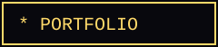
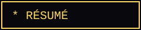
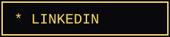
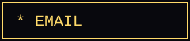
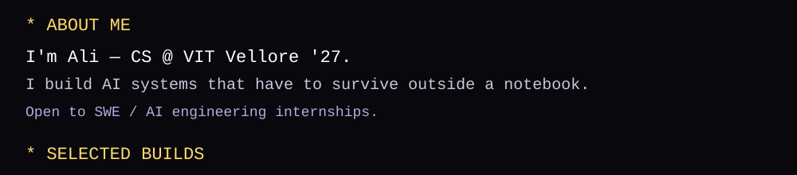
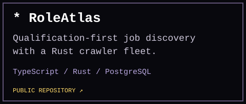
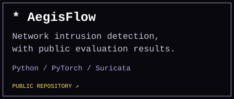
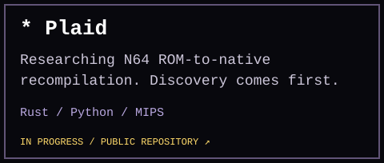
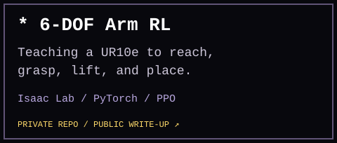
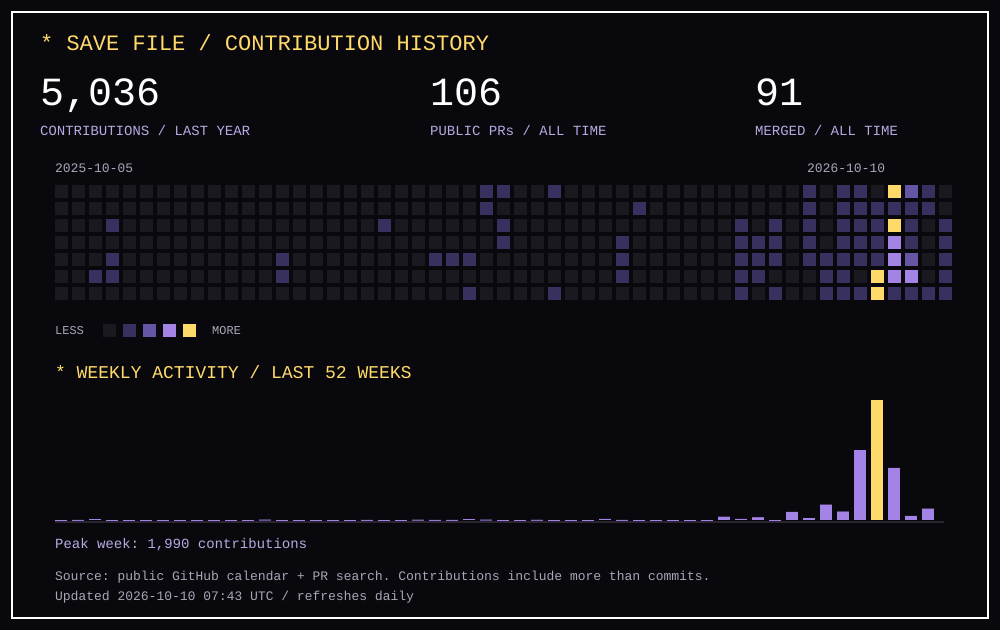

  

  <a href="https://sting-raider.github.io/portfolio/"></a>
  <a href="https://github.com/sting-raider/Resume/blob/main/Ali_Sufiyan_Khan_Resume.pdf"></a>
  <a href="https://www.linkedin.com/in/ali-khan-4197b1217/"></a>
  <a href="mailto:alizaydsab@gmail.com"></a>

  

  <a href="https://github.com/sting-raider/RoleAtlas"></a>
  <a href="https://github.com/sting-raider/AegisFlow"></a>

  <a href="https://github.com/sting-raider/Plaid"></a>
  <a href="https://sting-raider.github.io/portfolio/projects/robotic-arm/"></a>

  <a href="https://github.com/sting-raider?tab=overview"></a>

